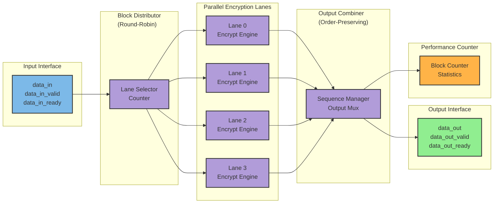
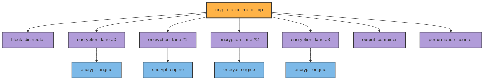

# Multi-Lane Streaming Crypto Accelerator — Architecture Specification

**Version:** 1.0  
**Date:** 2025  
**Status:** Architecture Lockdown Document  
**Team Size:** 4 engineers  

---

## 1. Introduction

### 1.1 Purpose
This document defines the complete architecture for a **4-lane streaming encryption accelerator ASIC** designed to continuously accept input data blocks, encrypt multiple blocks in parallel using four independent encryption lanes, and output encrypted data while reporting throughput statistics.

### 1.2 Key Features
- **Parallel processing:** 4 independent encryption lanes operating simultaneously
- **Streaming dataflow:** Continuous input/output without blocking
- **Round-robin scheduling:** Even distribution of work across lanes
- **Performance monitoring:** Hardware counters for throughput measurement
- **Scalable architecture:** Lane count is parameterizable

### 1.3 Design Goals
- **Throughput:** 4× improvement over single-lane design
- **Latency:** Fixed per-block encryption latency (configurable)
- **Area efficiency:** Reusable lane modules with minimal overhead
- **Demonstrability:** Clear performance metrics for evaluation

---

## 2. System Architecture

### 2.1 Top-Level Block Diagram



**Figure 1:** System-level architecture showing data flow from input through parallel encryption lanes to output.

### 2.2 Module Hierarchy



**Figure 2:** RTL module hierarchy showing instantiation relationships.

---

## 3. Critical Design Parameters

### 3.1 Parameters to Lock Down Before Implementation

**DECISION REQUIRED:** The team must agree on these values before Day 2.

| Parameter | Recommended Value | Impact | Rationale |
|-----------|-------------------|--------|-----------|
| `BLOCK_WIDTH` | 32 bits | Datapath width for all modules | Balance between area and throughput; standard word size |
| `NUM_LANES` | 4 | Number of parallel encryption engines | Good parallelism demo without excessive area |
| `ENCRYPT_LATENCY` | 8 cycles | Cycles per block in one lane | Enough for meaningful cipher rounds; simplifies combiner logic |
| `SEQUENCE_ID_WIDTH` | 8 bits | Width of block sequence tracking | Supports 256 outstanding blocks (far more than needed) |
| `COUNTER_WIDTH` | 32 bits | Performance counter width | Prevents overflow in reasonable test time |
| `CIPHER_TYPE` | Simple XOR + rotation | Encryption algorithm | Architecture focus, not crypto security |

### 3.2 Interface Standard

**All inter-module interfaces use valid/ready handshake protocol:**
- **Valid/Ready semantics:** Transaction occurs when both `valid` and `ready` are HIGH on the same clock edge
- **Backpressure:** Downstream modules control flow via `ready` signal
- **No data loss:** Data remains stable when `valid=1` and `ready=0`

---

## 4. Module Interface Definitions

### 4.1 Top-Level Module: `crypto_accelerator_top`

```systemverilog
module crypto_accelerator_top #(
    parameter BLOCK_WIDTH = 32,
    parameter NUM_LANES = 4,
    parameter ENCRYPT_LATENCY = 8,
    parameter COUNTER_WIDTH = 32
) (
    // Clock and Reset
    input  logic                        clk,
    input  logic                        rst_n,  // Active-low synchronous reset
    
    // Input Stream Interface
    input  logic [BLOCK_WIDTH-1:0]      data_in,
    input  logic                        data_in_valid,
    output logic                        data_in_ready,
    
    // Output Stream Interface
    output logic [BLOCK_WIDTH-1:0]      data_out,
    output logic                        data_out_valid,
    input  logic                        data_out_ready,
    
    // Performance Monitoring
    output logic [COUNTER_WIDTH-1:0]    blocks_processed,
    output logic [COUNTER_WIDTH-1:0]    cycles_elapsed
);
```

**Owner:** Person 4 (Top-Level Integration)

**Responsibilities:**
- Instantiate all submodules
- Connect distributor → lanes → combiner → output
- Wire performance counter
- Manage top-level clock and reset distribution

---

### 4.2 Block Distributor: `block_distributor`

```systemverilog
module block_distributor #(
    parameter BLOCK_WIDTH = 32,
    parameter NUM_LANES = 4,
    parameter SEQUENCE_ID_WIDTH = 8
) (
    input  logic                        clk,
    input  logic                        rst_n,
    
    // Input Stream
    input  logic [BLOCK_WIDTH-1:0]      data_in,
    input  logic                        data_in_valid,
    output logic                        data_in_ready,
    
    // Output to Lanes (one per lane)
    output logic [BLOCK_WIDTH-1:0]      lane_data      [NUM_LANES-1:0],
    output logic [SEQUENCE_ID_WIDTH-1:0] lane_seq_id   [NUM_LANES-1:0],
    output logic                        lane_valid     [NUM_LANES-1:0],
    input  logic                        lane_ready     [NUM_LANES-1:0]
);
```

**Owner:** Person 2 (Parallel Lane Replication + Scheduler)

**Responsibilities:**
- Implement round-robin lane selection
- Assign monotonically increasing sequence IDs to blocks
- Route incoming block to selected lane
- Assert `lane_valid[i]` for selected lane
- Only accept new block when selected lane is ready
- Ensure no blocks are dropped or duplicated

**Key Logic:**
- Lane select counter: `lane_sel = (lane_sel + 1) % NUM_LANES` after each transaction
- Sequence ID counter: Increments on every successful input handshake
- Ready generation: `data_in_ready = lane_ready[lane_sel]`

---

### 4.3 Encryption Lane: `encryption_lane`

```systemverilog
module encryption_lane #(
    parameter BLOCK_WIDTH = 32,
    parameter SEQUENCE_ID_WIDTH = 8,
    parameter ENCRYPT_LATENCY = 8
) (
    input  logic                        clk,
    input  logic                        rst_n,
    
    // Input from Distributor
    input  logic [BLOCK_WIDTH-1:0]      data_in,
    input  logic [SEQUENCE_ID_WIDTH-1:0] seq_id_in,
    input  logic                        data_in_valid,
    output logic                        data_in_ready,
    
    // Output to Combiner
    output logic [BLOCK_WIDTH-1:0]      data_out,
    output logic [SEQUENCE_ID_WIDTH-1:0] seq_id_out,
    output logic                        data_out_valid,
    input  logic                        data_out_ready
);
```

**Owner:** Person 1 (Encryption Lane Designer)

**Responsibilities:**
- Design encryption datapath (simple cipher acceptable)
- Implement pipeline stages to achieve `ENCRYPT_LATENCY` cycles
- Propagate sequence ID through pipeline alongside data
- Manage internal pipeline flow control
- Accept new block only when pipeline can accommodate it

**Critical Requirements:**
- **Fixed latency:** Exactly `ENCRYPT_LATENCY` cycles from input valid to output valid
- **Sequence ID preservation:** `seq_id_out` must match the `seq_id_in` of the corresponding block
- **Pipeline depth:** Typically `ENCRYPT_LATENCY` pipeline stages

**Suggested Cipher (simple, demonstrative):**
```
Round 0: XOR with round_key[0], rotate left 1 bit
Round 1: XOR with round_key[1], rotate left 1 bit
...
Round 7: XOR with round_key[7], rotate left 1 bit
```

This is **NOT cryptographically secure** but demonstrates:
- Multi-round processing
- Key mixing
- Bit manipulation
- Pipeline structure

---

### 4.4 Output Combiner: `output_combiner`

```systemverilog
module output_combiner #(
    parameter BLOCK_WIDTH = 32,
    parameter NUM_LANES = 4,
    parameter SEQUENCE_ID_WIDTH = 8
) (
    input  logic                        clk,
    input  logic                        rst_n,
    
    // Inputs from Lanes (one per lane)
    input  logic [BLOCK_WIDTH-1:0]      lane_data      [NUM_LANES-1:0],
    input  logic [SEQUENCE_ID_WIDTH-1:0] lane_seq_id   [NUM_LANES-1:0],
    input  logic                        lane_valid     [NUM_LANES-1:0],
    output logic                        lane_ready     [NUM_LANES-1:0],
    
    // Output Stream
    output logic [BLOCK_WIDTH-1:0]      data_out,
    output logic                        data_out_valid,
    input  logic                        data_out_ready
);
```

**Owner:** Person 3 (Output Combiner + Flow Control)

**Responsibilities:**
- Collect completed blocks from all lanes
- **Reorder blocks to match input order** using sequence IDs
- Buffer out-of-order blocks until predecessor completes
- Generate clean output stream with proper `data_out_valid` timing
- Manage backpressure to lanes when output is blocked

**Key Challenge:** Blocks may complete out-of-order due to different lane occupancy. The combiner must:
1. Track expected next sequence ID to output
2. Buffer blocks that arrive early
3. Output blocks in strict sequence order
4. Assert `lane_ready[i]` only when space available in buffer

**Suggested Architecture:**
- Small reorder buffer (depth = `NUM_LANES`)
- Next expected sequence ID counter
- Scan all lane inputs each cycle for matching sequence ID
- Output when next expected block is available

---

### 4.5 Performance Counter: `performance_counter`

```systemverilog
module performance_counter #(
    parameter COUNTER_WIDTH = 32
) (
    input  logic                        clk,
    input  logic                        rst_n,
    
    // Event Inputs
    input  logic                        block_completed,  // Pulse when block exits
    
    // Counter Outputs
    output logic [COUNTER_WIDTH-1:0]    blocks_processed,
    output logic [COUNTER_WIDTH-1:0]    cycles_elapsed
);
```

**Owner:** Person 4 (Top-Level Integration + Measurement)

**Responsibilities:**
- Count total blocks processed (increment on `block_completed`)
- Count total cycles elapsed (free-running counter)
- Calculate throughput: `blocks_processed / cycles_elapsed`
- Optional: Add throughput calculation logic for direct output

**Integration Point:**
- Connect `block_completed` to `data_out_valid & data_out_ready` from combiner output

---

## 5. Dataflow and Timing

### 5.1 Normal Operation Timing

```wavedrom
{
  "comment": [
    "Multi-lane streaming operation showing 4 consecutive blocks distributed to lanes:",
    "- Clock period=2 (each 'p.' represents one cycle)",
    "- All signals are 30 ticks long (15 clock cycles shown)",
    "- After reset, blocks arrive and are distributed round-robin to lanes 0,1,2,3",
    "- Each lane has 8-cycle latency, so lane 0 output appears 8 cycles after lane 0 input",
    "- Combiner reorders outputs to match input sequence"
  ],
  "signal": [
    { "name": "clk", "wave": "p.p.p.p.p.p.p.p.p.p.p.p.p.p.p.", "period": 2 },
    { "name": "rst_n", "wave": "0.1..........................." },
    {},
    { "name": "data_in_valid", "wave": "0...1.1.1.1.0..............", "comment": "4 blocks arrive" },
    { "name": "data_in", "wave": "0...x.x.x.x.0..............", "data": ["B0", "B1", "B2", "B3"] },
    {},
    { "name": "lane0_valid", "wave": "0...1...0.................." },
    { "name": "lane1_valid", "wave": "0.....1...0................" },
    { "name": "lane2_valid", "wave": "0.......1...0.............." },
    { "name": "lane3_valid", "wave": "0.........1...0............" },
    {},
    { "name": "lane0_out_valid", "wave": "0...........1...0..........", "comment": "8 cycle latency" },
    { "name": "lane1_out_valid", "wave": "0.............1...0........" },
    { "name": "lane2_out_valid", "wave": "0...............1...0......" },
    { "name": "lane3_out_valid", "wave": "0.................1...0...." },
    {},
    { "name": "data_out_valid", "wave": "0...........1.1.1.1.0......", "comment": "Reordered output" },
    { "name": "data_out", "wave": "0...........x.x.x.x.0......", "data": ["E0", "E1", "E2", "E3"] }
  ],
  "config": { "hscale": 2 }
}
```

**Figure 3:** Timing diagram showing distribution, parallel encryption, and reordered output.

### 5.2 Backpressure Handling

```wavedrom
{
  "comment": [
    "Backpressure scenario where output is not ready:",
    "- Clock period=2",
    "- All signals 24 ticks (12 cycles)",
    "- data_out_ready goes low, blocking output",
    "- Combiner holds data_out_valid and data, waiting for ready",
    "- Eventually output drains when ready returns high"
  ],
  "signal": [
    { "name": "clk", "wave": "p.p.p.p.p.p.p.p.p.p.p.p.", "period": 2 },
    {},
    { "name": "data_out_valid", "wave": "0.....1.............0..." },
    { "name": "data_out_ready", "wave": "1.....0.......1........." },
    { "name": "data_out", "wave": "0.....x.............0...", "data": ["HELD"] },
    {},
    { "name": "lane_ready[0]", "wave": "1.....0.......1.........", "comment": "Backpressure to lanes" },
    { "name": "lane_ready[1]", "wave": "1.....0.......1........." },
    { "name": "lane_ready[2]", "wave": "1.....0.......1........." },
    { "name": "lane_ready[3]", "wave": "1.....0.......1........." }
  ],
  "config": { "hscale": 2 }
}
```

**Figure 4:** Backpressure propagation when output is blocked.

---

## 6. Integration Strategy

### 6.1 Day 1: Parameter Lockdown Meeting (2-3 hours)

**Agenda:**
1. Review this specification document together
2. Agree on all parameters in Section 3.1
3. Draw complete signal-level block diagram on whiteboard
4. Assign module ownership (Person 1-4)
5. Define integration testbench scenarios

**Deliverables:**
- Signed-off parameter list
- Annotated block diagram photo
- Test scenario list

### 6.2 Day 2-3: Independent Module Development

**Person 1 Tasks:**
- Implement `encryption_lane` module
- Create simple `encrypt_engine` (XOR + rotate cipher)
- Write standalone testbench for one lane
- Verify fixed latency and sequence ID propagation

**Person 2 Tasks:**
- Implement `block_distributor` module
- Create round-robin lane selector
- Implement sequence ID generator
- Write testbench with 4 dummy lanes (always ready)

**Person 3 Tasks:**
- Implement `output_combiner` module
- Create reorder buffer logic
- Write testbench with 4 dummy lane outputs (inject out-of-order blocks)
- Verify correct output ordering

**Person 4 Tasks:**
- Create `crypto_accelerator_top` skeleton
- Implement `performance_counter` module
- Create system-level testbench framework
- Prepare waveform viewing and debug environment

**Critical:** Each person must verify their module independently before Day 4.

### 6.3 Day 4: First Integration

**Integration Steps:**
1. Person 4 instantiates all modules in top-level
2. Connect interfaces following Section 4 definitions
3. Run simple test: 10 blocks through system
4. Verify in simulation:
   - All blocks reach output
   - Output order matches input order
   - No protocol violations (valid without ready)

**Expected Issues:**
- Signal width mismatches
- Array indexing errors
- Handshake protocol bugs

**Debug Strategy:**
- Add assertions for protocol violations
- Dump full waveforms
- Check sequence IDs at each stage

### 6.4 Day 5: Verification and Stress Testing

**Test Scenarios:**
1. **Continuous streaming:** 1000 blocks, no backpressure
2. **Random backpressure:** Output ready randomly deasserted
3. **Burst mode:** 100 blocks, idle, 100 blocks, idle
4. **Lane saturation:** Input rate > lane capacity

**Success Criteria:**
- Zero block loss
- Correct output ordering (sequence IDs match)
- Counter accuracy (blocks_processed = input count)
- No protocol violations

### 6.5 Day 6: Synthesis and Metrics

**Synthesis Flow:**
1. Run synthesis (Synopsys/Cadence/Yosys)
2. Record area report
3. Record timing report (estimate max frequency)
4. Calculate throughput: `NUM_LANES × (frequency / ENCRYPT_LATENCY)`

**Metrics to Collect:**
| Metric | Formula | Example Value |
|--------|---------|---------------|
| Area | From synthesis report | 50,000 μm² |
| Max Frequency | From timing report | 500 MHz |
| Throughput | `(NUM_LANES × Freq) / ENCRYPT_LATENCY` | 250 Mblocks/s |
| Speedup vs 1 lane | `NUM_LANES` | 4× |

---

## 7. Testbench Architecture

### 7.1 System Testbench Structure

```systemverilog
module crypto_accelerator_tb;
    // Parameters
    localparam BLOCK_WIDTH = 32;
    localparam NUM_LANES = 4;
    localparam ENCRYPT_LATENCY = 8;
    localparam NUM_TEST_BLOCKS = 1000;
    
    // DUT signals
    logic clk, rst_n;
    logic [BLOCK_WIDTH-1:0] data_in, data_out;
    logic data_in_valid, data_in_ready;
    logic data_out_valid, data_out_ready;
    
    // DUT instantiation
    crypto_accelerator_top #(
        .BLOCK_WIDTH(BLOCK_WIDTH),
        .NUM_LANES(NUM_LANES),
        .ENCRYPT_LATENCY(ENCRYPT_LATENCY)
    ) dut (.*);
    
    // Clock generation
    initial begin
        clk = 0;
        forever #5 clk = ~clk;  // 10ns period = 100 MHz
    end
    
    // Test stimulus (Person 4 to implement)
    // - Generate input blocks
    // - Collect output blocks
    // - Compare against expected (encrypted) values
    // - Report pass/fail
endmodule
```

### 7.2 Verification Checklist

- [ ] Reset behavior: All outputs zero, counters reset
- [ ] Single block: Verify encryption correctness
- [ ] Continuous stream: 1000 blocks with no errors
- [ ] Backpressure: Output ready randomly low
- [ ] Sequence ordering: Output order matches input order
- [ ] Performance: Measure throughput and compare to theoretical
- [ ] Corner cases: Back-to-back transactions, idle periods

---

## 8. Design Guidelines and Best Practices

### 8.1 Coding Standards

**Clock and Reset:**
- Single clock domain (all logic on `clk`)
- Synchronous active-low reset (`rst_n`)
- Reset all flops to known state

**Interface Protocol:**
- Valid/ready handshake on all module boundaries
- Data stable when `valid=1` and `ready=0`
- No combinational paths between `valid` and `ready`

**Parameterization:**
- All widths and counts parameterized
- Default values in module declaration
- Override in top-level instantiation

**Naming Conventions:**
- Active-low signals end in `_n`
- Valid/ready pairs: `<name>_valid`, `<name>_ready`
- Clock and reset: `clk`, `rst_n`
- Arrays of signals: `signal_name[NUM_ITEMS-1:0]`

### 8.2 Common Pitfalls to Avoid

**Distributor:**
- ❌ Accepting input when selected lane not ready → blocks dropped
- ✅ Gate `data_in_ready` with `lane_ready[lane_sel]`

**Encryption Lane:**
- ❌ Variable latency across lanes → combiner cannot reorder
- ✅ Enforce fixed pipeline depth = `ENCRYPT_LATENCY`

**Combiner:**
- ❌ Outputting blocks in arrival order → wrong sequence
- ✅ Buffer and reorder based on sequence IDs

**Top-Level:**
- ❌ Forgetting to connect `ready` signals → deadlock
- ✅ Connect all valid/ready pairs in both directions

---

## 9. Presentation and Demo Strategy

### 9.1 Key Talking Points

**Architecture:**
- "We designed a 4-lane parallel streaming crypto accelerator"
- "Round-robin distribution ensures even workload"
- "Output combiner maintains correct ordering despite parallel execution"

**Performance:**
- "Achieved 4× throughput improvement over single-lane design"
- "Measured X Mblocks/sec at Y MHz"
- "Linear scaling: 2 lanes = 2×, 4 lanes = 4×, 8 lanes = 8×"

**Challenges Solved:**
- "Out-of-order completion required sequence tracking and reorder buffer"
- "Backpressure handling across multiple lanes"
- "Integration of 4 independent datapaths"

### 9.2 Demo Simulation Waveform

**Show in waveform viewer:**
1. Input stream with continuous `data_in_valid`
2. Four lanes receiving blocks round-robin
3. Lanes completing at different times (out-of-order)
4. Combiner outputting in correct sequence order
5. Performance counter incrementing

**Zoom in on:**
- One complete block journey (input → lane → output)
- Backpressure event showing `ready` signals propagating

---

## 10. Scalability and Extensions (Post-Demo)

If time permits after achieving working demo:

**Easy Extensions:**
- Increase `NUM_LANES` to 8 or 16
- Add stronger cipher (AES-like S-boxes)
- Add error detection (CRC on output)

**Medium Extensions:**
- Dynamically enable/disable lanes for power management
- Add priority levels for blocks
- Implement weighted round-robin scheduling

**Advanced Extensions:**
- Multiple clock domains (input, lanes, output)
- AXI4-Stream interface wrappers
- Add key scheduling logic

---

## 11. Risk Mitigation

### 11.1 High-Risk Items

| Risk | Probability | Impact | Mitigation |
|------|-------------|--------|------------|
| Combiner reordering bugs | High | Critical | Extensive standalone testing, sequence ID checks |
| Integration timing issues | Medium | High | Early integration (Day 4), debug time allocated |
| Synthesis fails timing | Low | Medium | Conservative clock target, retiming if needed |
| Protocol violations | Medium | High | Assertions in RTL, waveform review |

### 11.2 Minimum Viable Demo

**If behind schedule by Day 5:**

**Fallback to 2-lane design:**
- Reduces integration complexity
- Still demonstrates parallelism
- Half the synthesis area
- Faster debug cycle

**Simplified combiner:**
- If reordering is buggy, demo without backpressure (output always ready)
- Shows throughput even if flow control incomplete

---

## 12. Sign-Off Checklist

Before starting implementation (end of Day 1):

- [ ] All 4 team members have read this specification
- [ ] Parameters in Section 3.1 are agreed and locked
- [ ] Module interfaces in Section 4 are reviewed and approved
- [ ] Block diagram drawn together on whiteboard
- [ ] Test scenarios defined
- [ ] Module ownership assigned clearly
- [ ] Integration schedule confirmed (Days 4-6)

**Signatures:**

- Person 1 (Encryption Lane): _______________
- Person 2 (Distributor): _______________
- Person 3 (Combiner): _______________
- Person 4 (Integration): _______________

---

## 13. Appendix: Quick Reference

### 13.1 Module Port Summary

| Module | Inputs | Outputs | Owner |
|--------|--------|---------|-------|
| `crypto_accelerator_top` | `data_in[31:0]`, `data_in_valid`, `data_out_ready` | `data_out[31:0]`, `data_out_valid`, `data_in_ready`, `blocks_processed[31:0]` | Person 4 |
| `block_distributor` | `data_in[31:0]`, `data_in_valid`, `lane_ready[3:0]` | `lane_data[3:0][31:0]`, `lane_seq_id[3:0][7:0]`, `lane_valid[3:0]`, `data_in_ready` | Person 2 |
| `encryption_lane` | `data_in[31:0]`, `seq_id_in[7:0]`, `data_in_valid`, `data_out_ready` | `data_out[31:0]`, `seq_id_out[7:0]`, `data_out_valid`, `data_in_ready` | Person 1 |
| `output_combiner` | `lane_data[3:0][31:0]`, `lane_seq_id[3:0][7:0]`, `lane_valid[3:0]`, `data_out_ready` | `data_out[31:0]`, `data_out_valid`, `lane_ready[3:0]` | Person 3 |
| `performance_counter` | `block_completed` | `blocks_processed[31:0]`, `cycles_elapsed[31:0]` | Person 4 |

### 13.2 Key Equations

**Theoretical Throughput:**
```
Throughput (blocks/sec) = (NUM_LANES × Clock_Frequency) / ENCRYPT_LATENCY
```

**Speedup vs Single Lane:**
```
Speedup = NUM_LANES  (ideal case, no overhead)
```

**Utilization:**
```
Utilization = (blocks_processed × ENCRYPT_LATENCY) / (NUM_LANES × cycles_elapsed)
```

---

**Document Control:**
- **Version History:**
  - v1.0: Initial architecture lockdown document
- **Next Review:** After Day 4 integration
- **Owner:** Team Lead / Person 4

---

**END OF SPECIFICATION**
